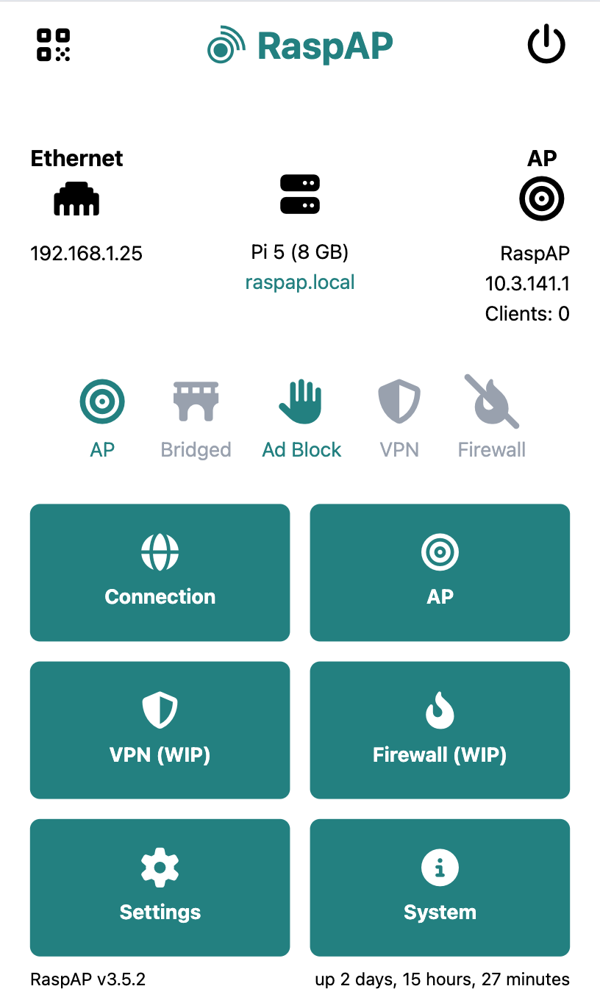
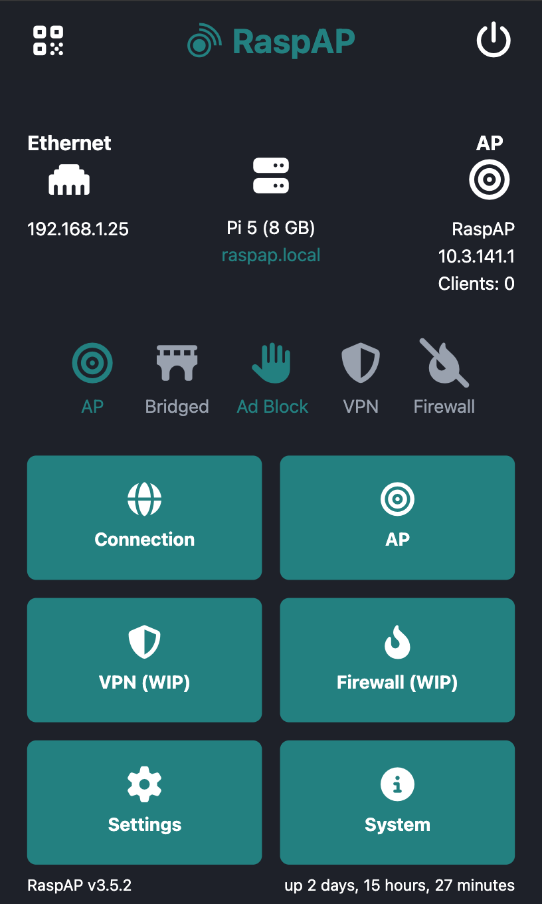

# RaspAP Web Display

> Note: This project is in very early stages and all features may not be working. Looking forward to the first "offical" version.

A web interface for an integrated experience on a RaspAP device

This project was inspired by [RaspAP E-Paper Display Controller](https://github.com/id8872/raspap_display) and the other similar projects.

Light | Dark
:-------------------------:|:-------------------------:
  |  

## Features

- Dashboard
    - AP QR Code and Info
    - Power Controls
    - Connection/Hardware/AP/Status Info at a glance
    - Quick Buttons
        - Connection
        - AP
        - VPN (WIP)
        - Firewall (WIP)
        - Settings
        - System Info
- AP
    - AP Info
    - Interface/DHCP Info
    - Active Client List
        - Wireless
        - Ethernet (WIP)
- Settings
    - Theme control
        - Schedule/Light/Dark
        - Set schedule times
    - Screen Timeout
- System Info
    - RaspAP Info
    - System Versions
    - System Metrics
    - Interfaces (Accordion)

## Feature ToDos

- Brightness control
    - Brightness %
    - Brightness Schedule
- Landscape Orientation Support
- AdBlock, VPN and Firewall Support

## How's it work?

RaspAP Web Display uses the following tools to make an engaging experience

- NodeJS (Backend Server as well as front end static files)
- Preact (Quick and smooth front end templating)
- Labwc (A desktop without the extras)
- Squeekboard (On-Screen keyboard)
- [Chromium](FAQ.md#why-chromium) (Gives us a browser to load the interface in kiosk mode)

It leverages the REST API included with RaspAP to gather the necessary data. While it is experimental, the approach is to have fallbacks on a version basis to fill in the gaps and shortcomings. Instead of creating the wheel twice, it's better to focus efforts on improving the API for everyone's benefit.

## Setup
> [I already installed with Weston](FAQ.md#what-to-do-if-i-installed-with-weston)

Start by cloning the repository to your home directory (usually `/home/pi` or `~/`
```
cd ~/
git clone https://github.com/Jixabon/raspap_web_display.git
```

Run the install script
```
cd ~/raspap_web_display
sudo ./install.sh
```

Set your API Key in `.env`

Enable Auto Login
```
sudo raspi-config
```
- Choose option: 1 System Options
- Choose option: S6 Auto Login
- Choose option: Yes/OK/Finish

## Development and Customization

RaspAP Web Display uses preact to generate a light and fast static "website" for the interface. To customize this you need to do a little setup.

```
cd html
npm install
```

From here you can use the npm scripts to server the site with `npm run dev`. This will auto refresh to make thigs easier. keep the main server running to maintain access to the RaspAP API. When you are done making it your own be sure to run `npm run build` as the main server uses the static files only.

## Hardware Support
As of right now the only hardware supported is what I have.
- Raspberry Pi 5 (8GB)
    - RaspAP installed by Raspberry Pi Imager
- Pimoroni HyperPixel 4.0